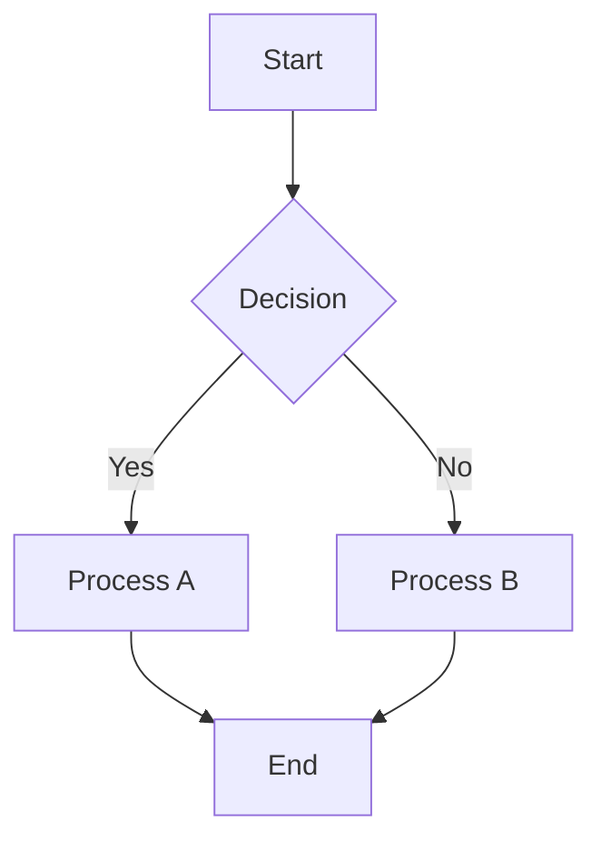
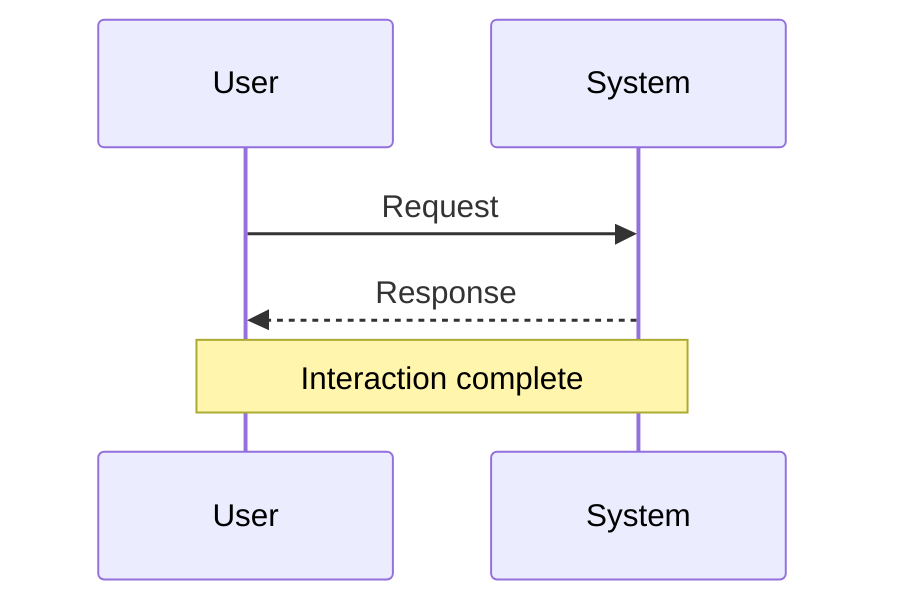
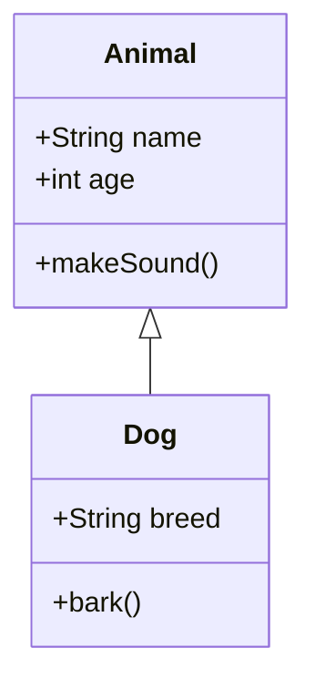
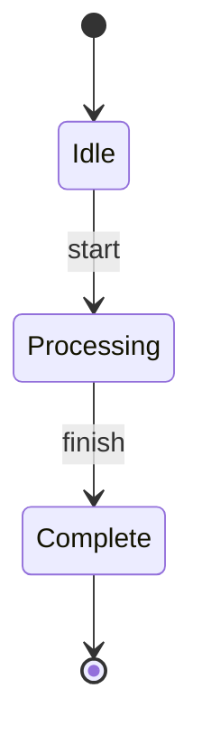
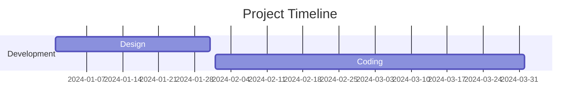
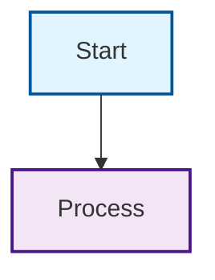

# 📝 DiagramAI Mermaid Editor Documentation

*Last Updated: May 30, 2025*

## Overview

The DiagramAI Mermaid Editor provides a powerful text-based diagram creation experience with live preview, syntax highlighting, and AI-enhanced features. Built on Mermaid.js, it supports multiple diagram types with real-time rendering.

## 🏗️ Architecture

### Component Structure

```
MermaidEditor/
├── MermaidEditor.tsx         # Main editor container
├── MermaidViewer.tsx         # Original viewer component
├── MermaidViewerFixed.tsx    # Enhanced viewer with robust rendering
├── SyntaxEditor.tsx          # Code editor with highlighting
├── PreviewPanel.tsx          # Live preview panel
└── services/
    └── MermaidService.ts     # Singleton service for rendering
```

### Service Layer

**MermaidService Singleton**
```typescript
class MermaidService {
  private static instance: MermaidService;
  private isInitialized = false;
  
  static getInstance(): MermaidService {
    if (!MermaidService.instance) {
      MermaidService.instance = new MermaidService();
    }
    return MermaidService.instance;
  }
  
  async initialize(): Promise<void> {
    // Global Mermaid configuration
  }
  
  async renderDiagram(element: HTMLElement, syntax: string): Promise<void> {
    // Robust rendering with error handling
  }
}
```

## 🎯 Core Features

### Syntax Editor

#### Code Editing Features

**Syntax Highlighting**
- Mermaid-specific syntax coloring
- Error highlighting for invalid syntax
- Bracket matching and auto-completion
- Line numbers and code folding

**Editor Configuration**
```typescript
const editorConfig = {
  language: 'mermaid',
  theme: 'vs-dark',
  automaticLayout: true,
  minimap: { enabled: false },
  scrollBeyondLastLine: false,
  wordWrap: 'on',
  lineNumbers: 'on',
  folding: true,
};
```

#### Live Validation

**Real-time Syntax Checking**
```typescript
const validateSyntax = (syntax: string): ValidationResult => {
  try {
    mermaid.parse(syntax);
    return { valid: true, errors: [] };
  } catch (error) {
    return { 
      valid: false, 
      errors: [{ line: error.line, message: error.message }] 
    };
  }
};
```

### Live Preview

#### Rendering System

**MermaidViewerFixed Component**
- **Robust Rendering**: Retry logic with exponential backoff
- **Dimension Validation**: Ensures proper container sizing
- **Error Recovery**: Graceful handling of rendering failures
- **Performance Optimization**: Memoized content processing

**Rendering Process**
```typescript
const renderMermaid = async () => {
  try {
    // 1. Validate container dimensions
    if (containerRect.width === 0 || containerRect.height === 0) {
      throw new Error('Container has zero dimensions');
    }
    
    // 2. Initialize MermaidService
    const mermaidService = MermaidService.getInstance();
    await mermaidService.initialize();
    
    // 3. Create and configure mermaid element
    const mermaidDiv = document.createElement('div');
    mermaidDiv.className = 'mermaid';
    mermaidDiv.textContent = mermaidSyntax;
    
    // 4. Render with service
    await mermaidService.renderDiagram(mermaidDiv, mermaidSyntax);
    
    setIsLoading(false);
  } catch (error) {
    setError(error.message);
    setIsLoading(false);
  }
};
```

#### Error Handling

**Visual Error Indicators**
```typescript
if (error) {
  return (
    <div className="error-container">
      <div className="error-title">❌ Rendering Error</div>
      <div className="error-message">Cannot render Mermaid: {error}</div>
      <button onClick={retry}>🔄 Retry Rendering</button>
    </div>
  );
}
```

**Debug Logging**
- Comprehensive console logging with emoji prefixes
- Container dimension tracking
- Rendering step validation
- Performance timing

## 📊 Supported Diagram Types

### Flowcharts

**Basic Syntax**


**Advanced Features**
- Subgraphs for grouping
- Custom node shapes
- Styling with CSS classes
- Click events and links

### Sequence Diagrams

**Basic Syntax**


**Advanced Features**
- Activation boxes
- Loops and alternatives
- Notes and comments
- Auto-numbering

### Class Diagrams

**Basic Syntax**


**Advanced Features**
- Inheritance relationships
- Composition and aggregation
- Method and property visibility
- Annotations and stereotypes

### State Diagrams

**Basic Syntax**


### Gantt Charts

**Basic Syntax**


### Git Graphs

**Basic Syntax**
```mermaid
gitgraph
    commit
    branch develop
    checkout develop
    commit
    checkout main
    merge develop
```

## 🎨 Styling and Theming

### Theme Configuration

**Built-in Themes**
```typescript
const themes = {
  default: 'default',
  dark: 'dark',
  forest: 'forest',
  neutral: 'neutral',
  base: 'base',
};
```

**Custom Styling**


### Responsive Design

**Container Sizing**
```css
.mermaid-container {
  width: 100%;
  height: 500px;
  border: 3px solid blue;
  background-color: #f0f8ff;
  margin: 20px auto;
  position: relative;
  display: block;
}

.mermaid {
  width: 600px !important;
  height: 400px !important;
  display: block !important;
  visibility: visible !important;
}
```

## ⚡ Performance Optimization

### Rendering Optimizations

**Memoized Content Processing**
```typescript
const mermaidSyntax = React.useMemo(() => {
  if (typeof content === 'string') {
    return content;
  }
  if (typeof content === 'object' && content) {
    return content.syntax || content.mermaidSyntax || content.content || '';
  }
  return 'graph LR\n    A[No Content] --> B[Error]';
}, [content]);
```

**Debounced Updates**
```typescript
const debouncedRender = useMemo(
  () => debounce((syntax: string) => {
    renderDiagram(syntax);
  }, 300),
  []
);
```

### Memory Management

**Component Cleanup**
```typescript
useEffect(() => {
  return () => {
    // Cleanup mermaid instances
    if (containerRef.current) {
      containerRef.current.innerHTML = '';
    }
  };
}, []);
```

**Service Initialization**
- Singleton pattern prevents multiple initializations
- Global configuration caching
- Efficient resource management

## 🔧 Configuration Options

### Editor Settings

```typescript
interface MermaidEditorProps {
  initialSyntax?: string;
  onSyntaxChange?: (syntax: string) => void;
  theme?: 'light' | 'dark';
  readOnly?: boolean;
  showLineNumbers?: boolean;
  enableAutoComplete?: boolean;
  validateOnType?: boolean;
  previewMode?: 'side' | 'bottom' | 'hidden';
}
```

### Mermaid Configuration

```typescript
const mermaidConfig = {
  startOnLoad: false,
  theme: 'default',
  securityLevel: 'loose',
  fontFamily: 'Inter, system-ui, sans-serif',
  fontSize: 14,
  flowchart: {
    useMaxWidth: true,
    htmlLabels: true,
    curve: 'basis',
  },
  sequence: {
    useMaxWidth: true,
    wrap: true,
  },
  gantt: {
    useMaxWidth: true,
  },
};
```

## 🧪 Testing

### Unit Tests

**Syntax Validation Tests**
```typescript
describe('Mermaid Syntax Validation', () => {
  it('validates correct flowchart syntax', () => {
    const syntax = 'graph TD\n    A --> B';
    const result = validateSyntax(syntax);
    expect(result.valid).toBe(true);
  });
  
  it('detects syntax errors', () => {
    const syntax = 'graph TD\n    A --> ';
    const result = validateSyntax(syntax);
    expect(result.valid).toBe(false);
    expect(result.errors).toHaveLength(1);
  });
});
```

**Rendering Tests**
```typescript
describe('MermaidViewer', () => {
  it('renders simple diagram correctly', async () => {
    const syntax = 'graph TD\n    A --> B';
    render(<MermaidViewer content={syntax} />);
    
    await waitFor(() => {
      expect(screen.getByRole('img')).toBeInTheDocument();
    });
  });
});
```

### E2E Tests

**Editor Integration Tests**
```typescript
describe('Mermaid Editor E2E', () => {
  it('updates preview when syntax changes', async () => {
    await page.goto('/editor');
    await page.click('[data-testid="mermaid-tab"]');
    
    await page.fill('.syntax-editor', 'graph TD\n    A --> B');
    
    await expect(page.locator('.mermaid svg')).toBeVisible();
  });
});
```

## 🔗 Integration Points

### AI Integration

**AI-Generated Diagrams**
```typescript
const generateDiagramFromPrompt = async (prompt: string): Promise<string> => {
  const response = await aiService.generateDiagram(prompt, 'mermaid');
  return response.syntax;
};
```

**Syntax Improvement**
```typescript
const improveDiagramSyntax = async (syntax: string): Promise<string> => {
  const response = await aiService.improveDiagram(syntax, 'mermaid');
  return response.improvedSyntax;
};
```

### Real-time Collaboration

**Syntax Synchronization**
```typescript
const handleSyntaxChange = (newSyntax: string) => {
  setSyntax(newSyntax);
  
  // Broadcast to other users
  websocketService.broadcast({
    type: 'syntax_update',
    syntax: newSyntax,
    timestamp: Date.now(),
  });
};
```

### Export System

**Export Options**
- **PNG**: High-resolution raster export
- **SVG**: Scalable vector export
- **PDF**: Print-ready document
- **Mermaid Code**: Raw syntax for sharing

```typescript
const exportDiagram = async (format: 'png' | 'svg' | 'pdf') => {
  const svgElement = containerRef.current?.querySelector('svg');
  if (!svgElement) return;
  
  switch (format) {
    case 'png':
      return await svgToPng(svgElement);
    case 'svg':
      return svgElement.outerHTML;
    case 'pdf':
      return await svgToPdf(svgElement);
  }
};
```

## 📚 Syntax Reference

### Quick Reference

**Flowchart Shapes**
- `A[Rectangle]`
- `B(Round edges)`
- `C{Diamond}`
- `D((Circle))`
- `E>Flag shape]`

**Flowchart Connections**
- `A --> B` (Arrow)
- `A --- B` (Line)
- `A -.-> B` (Dotted arrow)
- `A ==> B` (Thick arrow)

**Sequence Diagram Elements**
- `A->>B: Message`
- `A-->>B: Dotted message`
- `A-xB: Message with cross`
- `Note over A,B: Note`

### Best Practices

1. **Use descriptive labels** for better readability
2. **Group related elements** with subgraphs
3. **Apply consistent styling** throughout diagrams
4. **Keep diagrams focused** - break complex flows into multiple diagrams
5. **Use comments** to document complex logic

## 🆘 Troubleshooting

### Common Issues

**Rendering Failures**
- Check syntax validity
- Verify container dimensions
- Clear browser cache
- Check console for errors

**Performance Issues**
- Reduce diagram complexity
- Enable performance mode
- Use simpler node shapes
- Optimize browser settings

**Syntax Errors**
- Use syntax validator
- Check Mermaid documentation
- Start with simple examples
- Validate step by step

---

*For advanced usage patterns and integration examples, see the [Development Guide](../development/quick-start.md) and [API Documentation](../api/rest-api-reference.md).*
