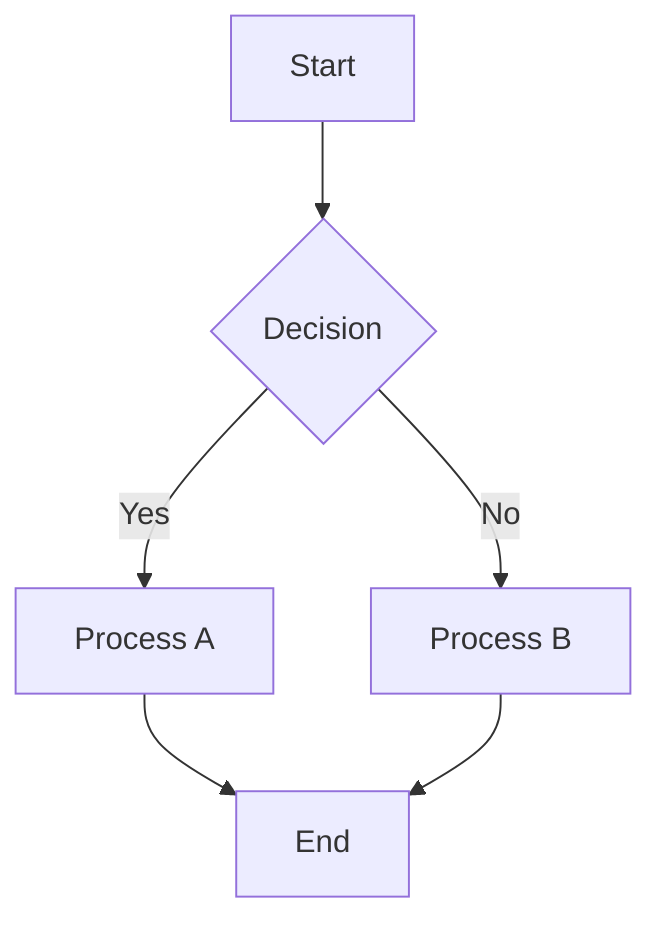
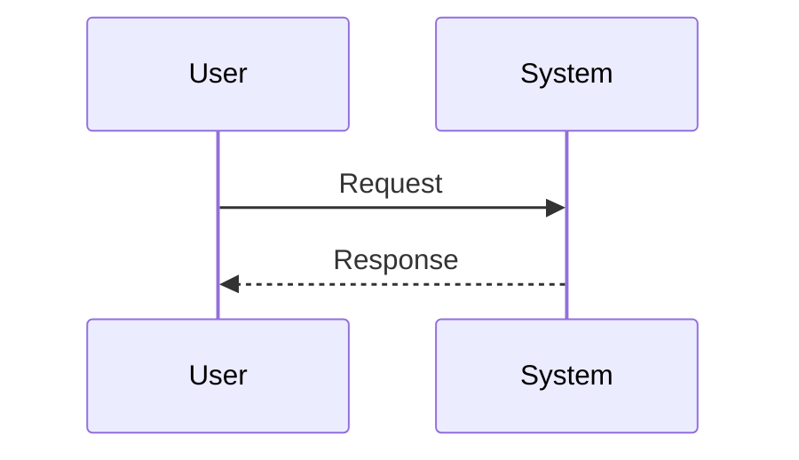

# 📖 DiagramAI User Guide

*Last Updated: May 30, 2025*

## Welcome to DiagramAI

DiagramAI is a powerful, AI-enhanced diagram editor that supports both visual editing with React Flow and text-based diagrams with Mermaid syntax. This guide will help you get started and master all features.

## 🚀 Getting Started

### First Steps

1. **Access DiagramAI**: Navigate to your DiagramAI instance (typically http://localhost:3000)
2. **Create Your First Diagram**: Click "Create New Diagram" on the homepage
3. **Choose Your Editor**: Select between Visual Editor (React Flow) or Mermaid Editor

### Interface Overview

**Main Navigation**
- **Home**: Return to diagram list
- **Create**: Start a new diagram
- **Settings**: Configure API keys and preferences

**Editor Interface**
- **Tab Switcher**: Toggle between Visual and Mermaid editors
- **Toolbar**: Access editing tools and options
- **Canvas**: Main editing area
- **Properties Panel**: Configure selected elements

## 🎨 Visual Editor (React Flow)

### Creating Diagrams

**Adding Nodes**
1. Use the **Node Palette** on the left sidebar
2. Click a node type to add it to the center
3. Drag nodes to position them
4. Double-click nodes to edit labels

**Available Node Types**
- **Start/End**: Process flow start and end points
- **Process**: Standard process steps
- **Decision**: Decision points with yes/no branches
- **Data**: Data storage or input/output
- **Custom**: User-defined node types

**Connecting Nodes**
1. Hover over a node to see connection handles
2. Drag from one handle to another to create edges
3. Click edges to add labels or styling
4. Use different edge types for various relationships

### Editing Features

**Node Customization**
- **Labels**: Double-click to edit text
- **Colors**: Use the color picker in properties panel
- **Sizes**: Resize using corner handles
- **Styles**: Apply different visual styles

**Layout Tools**
- **Auto-arrange**: Automatically organize nodes
- **Alignment**: Align selected nodes
- **Distribution**: Evenly space elements
- **Grouping**: Group related nodes together

**Selection and Manipulation**
- **Single Selection**: Click any element
- **Multi-Selection**: Ctrl+click or drag selection box
- **Copy/Paste**: Ctrl+C / Ctrl+V
- **Delete**: Delete key or right-click menu

## 📝 Mermaid Editor

### Syntax Basics

**Flowchart Example**

**Sequence Diagram Example**

### Supported Diagram Types

1. **Flowcharts**: Process flows and decision trees
2. **Sequence Diagrams**: Interaction between entities
3. **Class Diagrams**: Object-oriented design
4. **State Diagrams**: State transitions
5. **Gantt Charts**: Project timelines
6. **Git Graphs**: Version control flows

### Live Preview

- **Real-time Rendering**: See changes as you type
- **Error Highlighting**: Syntax errors highlighted in red
- **Zoom Controls**: Pan and zoom the preview
- **Export Options**: Save as PNG, SVG, or PDF

## 🤖 AI-Powered Features

### AI Diagram Generation

**Getting Started**
1. Configure API keys in Settings (OpenAI, Anthropic, or OpenRouter)
2. Use the AI prompt input in either editor
3. Describe your diagram in natural language
4. Review and refine the generated diagram

**Example Prompts**
- "Create a user login flow with error handling"
- "Design a microservices architecture for an e-commerce platform"
- "Show the process for handling customer support tickets"

**AI Capabilities**
- **Smart Node Placement**: Optimal layout generation
- **Relationship Detection**: Automatic connection creation
- **Style Suggestions**: Appropriate visual styling
- **Content Enhancement**: Rich labels and descriptions

### AI Improvement Suggestions

- **Optimization**: Get suggestions for better layouts
- **Completeness**: Identify missing elements
- **Best Practices**: Apply industry standards
- **Accessibility**: Improve diagram readability

## ⚡ Real-time Collaboration

### Multi-User Editing

**Sharing Diagrams**
1. Click the "Share" button in any diagram
2. Copy the sharing link
3. Send to collaborators
4. Set permissions (view, comment, edit)

**Collaborative Features**
- **Live Cursors**: See where others are working
- **Real-time Updates**: Changes appear instantly
- **Conflict Resolution**: Automatic merge of simultaneous edits
- **Version History**: Track all changes over time

**Collaboration Indicators**
- **User Avatars**: See who's currently editing
- **Activity Feed**: Recent changes and comments
- **Presence Indicators**: Online/offline status

## ⚙️ Settings and Configuration

### API Key Management

**Supported Providers**
- **OpenAI**: GPT-4 and GPT-3.5 models
- **Anthropic**: Claude models
- **OpenRouter**: Access to multiple AI providers

**Configuration Steps**
1. Navigate to Settings
2. Enter your API keys
3. Test connection
4. Select preferred model

**Security Features**
- **Encrypted Storage**: Keys stored securely
- **Masked Display**: Keys partially hidden in UI
- **Validation**: Automatic key verification
- **Revocation**: Easy key removal

### Preferences

**Editor Settings**
- **Default Editor**: Choose Visual or Mermaid as default
- **Auto-save**: Configure automatic saving
- **Grid Settings**: Show/hide grid and snap-to-grid
- **Theme**: Light or dark mode

**Performance Settings**
- **Rendering Quality**: Balance quality vs performance
- **Cache Settings**: Optimize for speed
- **Memory Management**: Large diagram handling

## 💾 Saving and Exporting

### Save Options

**Auto-save**: Changes saved automatically every 30 seconds
**Manual Save**: Ctrl+S or Save button
**Version History**: Access previous versions
**Backup**: Automatic cloud backup (if configured)

### Export Formats

**Visual Editor Exports**
- **PNG**: High-quality raster image
- **SVG**: Scalable vector graphics
- **PDF**: Print-ready document
- **JSON**: Raw diagram data

**Mermaid Editor Exports**
- **PNG/SVG**: Rendered diagram image
- **Mermaid Code**: Raw syntax for sharing
- **PDF**: Professional document format
- **HTML**: Embeddable web format

## 🔍 Advanced Features

### Keyboard Shortcuts

| Action | Shortcut | Description |
|--------|----------|-------------|
| Save | Ctrl+S | Save current diagram |
| Copy | Ctrl+C | Copy selected elements |
| Paste | Ctrl+V | Paste copied elements |
| Undo | Ctrl+Z | Undo last action |
| Redo | Ctrl+Y | Redo last undone action |
| Select All | Ctrl+A | Select all elements |
| Delete | Delete | Remove selected elements |
| Zoom In | Ctrl++ | Increase zoom level |
| Zoom Out | Ctrl+- | Decrease zoom level |
| Fit View | Ctrl+0 | Fit diagram to view |

### Search and Navigation

**Element Search**
- **Find**: Ctrl+F to search for text in diagrams
- **Filter**: Filter elements by type or properties
- **Navigation**: Jump between search results

**Diagram Organization**
- **Folders**: Organize diagrams in folders
- **Tags**: Add tags for easy categorization
- **Favorites**: Mark frequently used diagrams

## 🆘 Troubleshooting

### Common Issues

**Diagram Not Loading**
- Check internet connection
- Refresh the page
- Clear browser cache

**AI Features Not Working**
- Verify API keys in Settings
- Check API key permissions
- Test with different prompts

**Real-time Sync Issues**
- Check WebSocket connection
- Refresh the page
- Contact administrator

### Performance Tips

**Large Diagrams**
- Use grouping to organize complex diagrams
- Enable performance mode in settings
- Consider breaking into multiple diagrams

**Browser Optimization**
- Use Chrome or Firefox for best performance
- Close unnecessary tabs
- Ensure sufficient RAM available

## 📚 Learning Resources

### Tutorials
- **Video Tutorials**: Step-by-step video guides
- **Interactive Tours**: In-app guided tours
- **Example Gallery**: Pre-built diagram templates

### Documentation
- **Mermaid Syntax**: Complete syntax reference
- **Best Practices**: Diagram design guidelines
- **API Documentation**: For developers

## 🆘 Support

- **Help Center**: In-app help and documentation
- **Community Forum**: User discussions and tips
- **Support Tickets**: Direct technical support
- **Feature Requests**: Suggest new features

---

*This user guide is continuously updated. For the latest features and updates, check the in-app help or visit our documentation site.*
